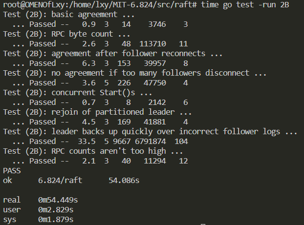
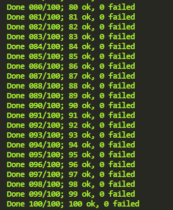

# MIT6.824
## References :link:

1. [Schedule of Lectures](https://pdos.csail.mit.edu/6.824/schedule.html)
2. [Go Tour](https://go.dev/tour) 
3. [Domestic Video Resources](https://www.bilibili.com/video/BV1x7411M7Sf/?p=9&vd_source=32f55c0f732463a8c1ed4c72feae6ab6)

## lab1: MapReduce 

::clipboard: test 

single test


multiple tests 


:bulb: **something useful:** 

1. [if you have no idea about the lab](https://www.bilibili.com/video/BV1sr4y1g7Lx/?spm_id_from=333.788&vd_source=32f55c0f732463a8c1ed4c72feae6ab6),When you have no idea, you can start with this video. This person’s idea at the beginning is wrong, so you will not get a useful implementation method 
directly. You only need to watch the first 2 videos to have a new view on this lab.
2. :page_facing_up: [my experiment note](https://github.com/SeeYouStellar/StudyAllTheTime/tree/master/MIT6.824)

## lab2: Raft

### lab2A leader election

::clipboard: test 

single test


multiple test


:bulb: **something useful:** 

1. [go-test-many.sh](https://gist.github.com/jonhoo/f686cacb4b9fe716d5aa), this file is used for many times test, which is run as ```bash go-test-many.sh [Times] [Parallel test number] [test subset]```
2. :page_facing_up: [my experiment note](https://github.com/SeeYouStellar/StudyAllTheTime/tree/master/MIT6.824)
 
### lab2B log replica
single test



multiple test


:bulb: **something useful:** 

1. :page_facing_up: [my experiment note](https://github.com/SeeYouStellar/StudyAllTheTime/tree/master/MIT6.824)
2. [Students' Guide to Raft](https://thesquareplanet.com/blog/students-guide-to-raft/)
3. [Q&A about lab](https://thesquareplanet.com/blog/raft-qa/)It is recommended to read this Q&A after read the Students' Guide to Raft and finish the experiment. If you can answer all the questions, then you fully understand raft.In most cases, you will find that many of the questions are puzzles that you will also encounter when reading the paper.

:bulb: **TODO:**

1. TestBackup2B takes too much time. The time given by the course website is 17.2s. The granularity of the lock needs to be improved.  
2. I use time.Timer to implement ticker thread，the course website recommand time.Sleep(). I will build other **branch named Lab2A** to complete the Lab2A soon.
3. The implement logic of RequestVote RPC and AppendEntries RPC maybe not best, should rebuild soon.

### lab2C Persistence

single test


multiple test


:bulb: **something useful:** 
1. 2C的测试代码中cfg.crash(server)表示的是使server宕机，而cfg.unconnect(server)表示的是形成网络分区，将该server与其他server断开网络连接，crash表示server内存中数据丢失需要使用持久化恢复，而unconnect后数据不会丢失。
2. :page_facing_up: [my experiment note](https://github.com/SeeYouStellar/StudyAllTheTime/tree/master/MIT6.824)

### lab2D log compaction


## lab3: KV Raft

## lab4: Sharded KV
